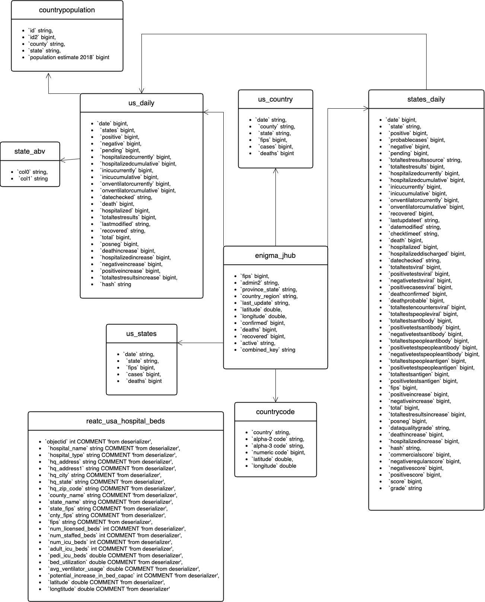

## Covid-19 Project with Amazon Web Services

 

### I. Project objectives
- Performing data modeling
- Data wrangling and extract-load-transform
- Hand on with Amazon Web Services and AWS tools such as boto4, Glue, S3, Athena and Redshift
- Understanding cloud computing services
 

### II. Tools and Usage
- Amazon S3: Storing the data
- Glue Crawler: Used to extract all the schema and information straight from S3
- Amazon Athena: Running adhoc sql queries on the available data in S3
- AWS Glue: data transformation
- Amazon Redshift: storing the tranfromed dimensional model in datawarehouse
- boto3: aws python sdk for create,configure, and manage AWS services.
 

### Dataset
- The dataset is provided by Amazon about COVID-19 case tracking data from Johns Hopkins and The New York Times, hospital bed availability from Definitive Healthcare, and over 45,000 research articles about COVID-19 and related coronaviruses from the Allen Institute for AI.

- Data Set: https://covid19-lake.s3.amazonaws.com/index.html

### III. Architecture

### IV. Flow
1. Dataset is stored in the S3 storage
2. Create and run Crawlers on the data is updaloed in S3 storage. 
3. This crawler will read file in S3 and save data into database of Athena service with table format. Then analysing data using AWS Athena query editor
4. Use python with libs boto3 to connect S3 and Athena service get data from Athena and S3
5. Continue with python to build Dimensional Model, then save Dimensional data into S3 and  Dimensional schema into Redshift
6. With python use libs redshift connecter to copy data from S3 to Redshift
7. Use Redshift for explore data, gain more insights and create visualization chart

### ER-Data Model

### Dimensional Model

